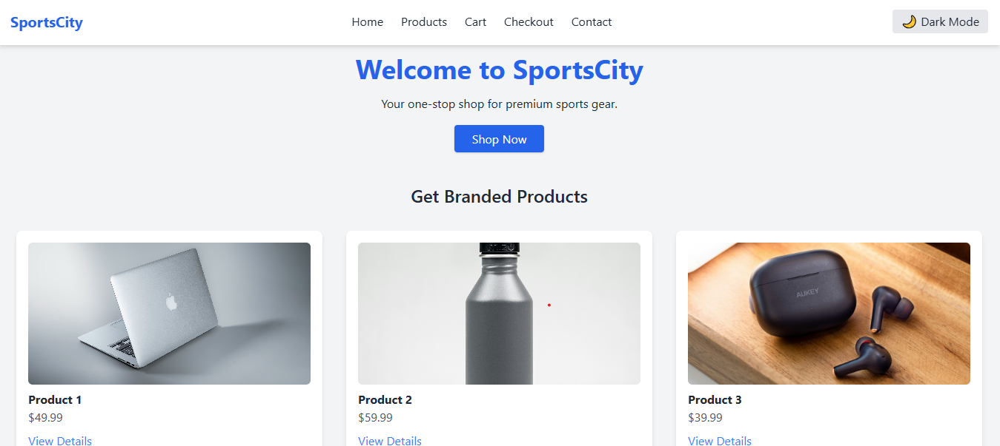
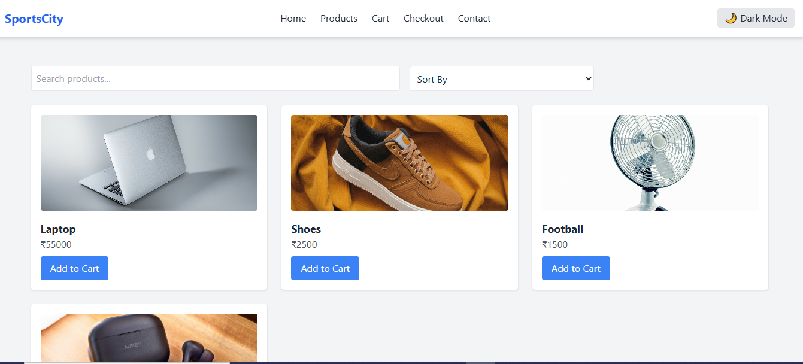
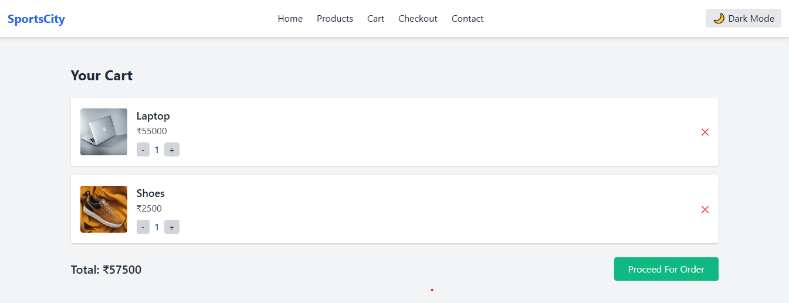

# ShopEase - Frontend E-Commerce Website

## 🚀 Live Demo
click here to view the project :[E:Commerce Website] (https://ankush-goniya.github.io/SpotsCity-Frontend-E-Commerce-/)

Welcome to **ShopEase**, a responsive and modern e-commerce front-end project developed as part of a Web Development Internship. This project demonstrates skills in **HTML, CSS, JavaScript**, and **Tailwind CSS** for building user-friendly, interactive, and responsive web pages.

---

## 🔹 Project Overview

ShopEase is a **frontend-only e-commerce website**. Users can:

- Browse products on the **Home** and **Products** pages.
- View product details on a dedicated **Product Details** page.
- Add/remove items to/from a **shopping cart**.
- See dynamic total price updates.
- Contact the store using a **Contact Form** with JavaScript validation.

> No backend or database is required for this version.

---

## 🔹 Features Implemented

### Core Features

- Responsive design with **Tailwind CSS**.
- Navigation bar with links to all pages.
- **Home Page**:
  - Hero banner with call-to-action.
  - Featured products (6+ product cards).
- **Products Page**:
  - Grid layout of all products.
  - Responsive design for mobile and desktop.
- **Product Details Page**:
  - Large product image and description.
  - “Add to Cart” button.
  - “You might also like” recommendations.
- **Cart Page**:
  - Add/remove items.
  - Quantity updates and dynamic total price calculation.
  - “Proceed to Checkout” button.
- **Contact Page**:
  - Form fields: Name, Email, Subject, Message.
  - JavaScript form validation.

### Bonus Features (Optional)

- Hover animations on product cards.
- Responsive mobile-friendly navigation.

---

## 🔹 Technologies Used

- **HTML5 & CSS3** (Semantic tags and modern layouts)
- **JavaScript** (Cart logic & form validation)
- **Tailwind CSS** (Responsive design and UI styling)

---

## 🔹 Screenshots

### Home Page



### Products Page



### Cart Page



_(Replace these images with actual screenshots from your project)_

---

## 🔹 How to Run Locally

1. **Clone the repository**

```bash
git clone https://github.com/Ankush-Goniya/SportsCity.git
```
